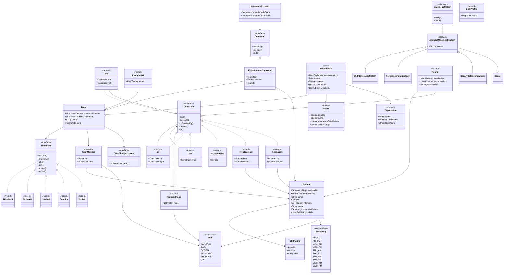

# Domain model

> Generated from the compiled code by `DomainDiagramTest`; do not edit by hand.
> Refresh with `./mvnw test -Dtest=DomainDiagramTest -Ddiagram.write=true`.

```mermaid
classDiagram
  class AbstractMatchingStrategy {
    <<abstract>>
    +Scorer scorer
  }
  class Active {
    <<record>>
  }
  class And {
    <<record>>
    +Constraint left
    +Constraint right
  }
  class Assignment {
    <<record>>
    +List~Team~ teams
  }
  class Availability {
    <<enumeration>>
    FRI_AM
    FRI_PM
    MON_AM
    MON_PM
    THU_AM
    THU_PM
    TUE_AM
    TUE_PM
    WED_AM
    WED_PM
  }
  class Command {
    <<interface>>
    +describe()
    +execute()
    +undo()
  }
  class CommandInvoker {
    +Deque~Command~ redoStack
    +Deque~Command~ undoStack
  }
  class Constraint {
    <<interface>>
    +and()
    +describe()
    +isSatisfiedBy()
    +negate()
    +or()
  }
  class Explanation {
    <<record>>
    +String reason
    +String studentName
    +String teamName
  }
  class Forming {
    <<record>>
  }
  class GreedyBalancerStrategy
  class KeepApart {
    <<record>>
    +Student first
    +Student second
  }
  class KeepTogether {
    <<record>>
    +Student first
    +Student second
  }
  class Locked {
    <<record>>
  }
  class MatchResult {
    <<record>>
    +List~Explanation~ explanations
    +Score score
    +String strategy
    +List~Team~ teams
    +List~String~ violations
  }
  class MatchingStrategy {
    <<interface>>
    +assign()
    +name()
  }
  class MaxTeamSize {
    <<record>>
    +int max
  }
  class MoveStudentCommand {
    +Team from
    +Student student
    +Team to
  }
  class Not {
    <<record>>
    +Constraint inner
  }
  class Or {
    <<record>>
    +Constraint left
    +Constraint right
  }
  class PreferenceFirstStrategy
  class RequiredRoles {
    <<record>>
    +Set~Role~ roles
  }
  class Reviewed {
    <<record>>
  }
  class Role {
    <<enumeration>>
    BACKEND
    DATA
    DESIGN
    FRONTEND
    PRODUCT
    QA
  }
  class Round {
    <<record>>
    +List~Student~ candidates
    +List~Constraint~ constraints
    +int targetTeamSize
  }
  class Score {
    <<record>>
    +double balance
    +double overall
    +double preferenceSatisfaction
    +double skillCoverage
  }
  class Scorer
  class SkillCoverageStrategy
  class SkillProfile {
    <<record>>
    +Map bestLevels
  }
  class SkillRating {
    +Long id
    +int level
    +String skill
  }
  class Student {
    +Set~Availability~ availability
    +Set~Role~ desiredRoles
    +String email
    +Long id
    +Set~String~ interests
    +String name
    +Set~Long~ preferredPeerIds
    +List~SkillRating~ skills
  }
  class Submitted {
    <<record>>
  }
  class Team {
    +List~TeamChangeListener~ listeners
    +List~TeamMember~ members
    +String name
    +TeamState state
  }
  class TeamChangeListener {
    <<interface>>
    +onTeamChanged()
  }
  class TeamMember {
    <<record>>
    +Role role
    +Student student
  }
  class TeamState {
    <<interface>>
    +activate()
    +isTerminal()
    +label()
    +lock()
    +review()
    +submit()
  }
  AbstractMatchingStrategy --> Scorer
  AbstractMatchingStrategy <|-- GreedyBalancerStrategy
  AbstractMatchingStrategy <|-- PreferenceFirstStrategy
  AbstractMatchingStrategy <|-- SkillCoverageStrategy
  And --> Constraint
  Assignment --> Team
  Command <|.. MoveStudentCommand
  CommandInvoker --> Command
  Constraint <|.. And
  Constraint <|.. KeepApart
  Constraint <|.. KeepTogether
  Constraint <|.. MaxTeamSize
  Constraint <|.. Not
  Constraint <|.. Or
  Constraint <|.. RequiredRoles
  KeepApart --> Student
  KeepTogether --> Student
  MatchResult --> Explanation
  MatchResult --> Score
  MatchResult --> Team
  MatchingStrategy <|.. AbstractMatchingStrategy
  MoveStudentCommand --> Student
  MoveStudentCommand --> Team
  Not --> Constraint
  Or --> Constraint
  RequiredRoles --> Role
  Round --> Constraint
  Round --> Student
  Student --> Availability
  Student --> Role
  Student --> SkillRating
  Team --> TeamChangeListener
  Team --> TeamMember
  Team --> TeamState
  TeamMember --> Role
  TeamMember --> Student
  TeamState <|.. Active
  TeamState <|.. Forming
  TeamState <|.. Locked
  TeamState <|.. Reviewed
  TeamState <|.. Submitted
```
